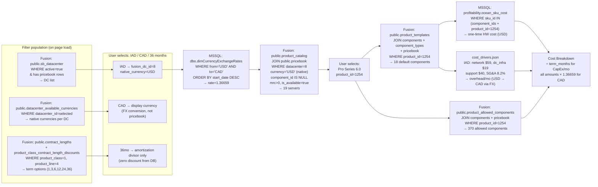

# CPQ Data Flow: Pro Series 6.0 — IAD (Washington DC) — CAD

> **Generated:** 2026-05-15 · Live data from Fusion PostgreSQL (via SSH tunnel) and MSSQL DM_BusinessInsights  
> **Scope:** Traces every filter selection (DC, currency, term) through to a fully priced quote.

---

## How the Three Filters Are Populated

Before any server is listed, the user makes three selections. Here is exactly where each comes from.

### Data Centers

**Authoritative source:** `Fusion.public.sb_datacenter`

```sql
SELECT sbd.id, sbd.dc_abbr, sbd.name, sbd.city, sbd.state, sbd.active
FROM public.sb_datacenter sbd
WHERE sbd.active = true
  AND sbd.id IN (
      SELECT DISTINCT datacenter
      FROM public.pricebook
      WHERE product_line_id = 4
        AND component_id IS NULL
        AND mrc > 0
        AND is_available = true
  )
ORDER BY sbd.name
```

This gives DCs that have actual server pricebook rows — the only ones worth showing.

**What the CPQ app does today:** The `/api/datacenters` endpoint returns the list from `cost_drivers.json`, not from `sb_datacenter`. The JSON only covers 7 DCs. Fusion has **18 DCs with active server pricebook rows**. The JSON acts as an allowlist/override with overhead rates — it is **not** the authoritative DC registry.

**Gap / action item:** Either (a) query `sb_datacenter` as the source of truth and cross-reference against `cost_drivers.json` for overhead data, or (b) expand `cost_drivers.json` to cover all 18 DCs. Currently DCs like CRO (Croydon), SAT5 (San Antonio), and TOR-431H (Horner) have pricebook rows but no `cost_drivers.json` entry, so they are invisible to the CPQ.

**All 18 DCs with active server pricebook rows (from Fusion):**

| fusion_dc_id | dc_abbr | Name | City, State | In cost_drivers.json? |
|---|---|---|---|---|
| 1 | ATL | Atlanta | Atlanta, GA | Yes |
| 2 | MIA | Miami | Miami, FL | Yes |
| 5 | LDN1 | London | Fleet, UK | No |
| 6 | SAT5 | Vicar | San Antonio, TX | No |
| 7 | LAX1 | Malibu (LAX) | Los Angeles, CA | Yes |
| 8 | IAD2 | South Pointe (IAD) | Herndon, VA | Yes |
| 12 | TOR | Toronto | Toronto, ON | Yes |
| 13 | POR | Portsmouth | Portsmouth, UK | Yes |
| 42 | MTL-BH | Montreal | Montreal, QC | Yes |
| 52 | CRO | Croydon | London, UK | No |
| 53 | GOS | Goswell | London, UK | No |
| 75–83 | various | various | various | No |

> Note: `sb_datacenter` does not store `native_currency`. That lives in `datacenter_available_currencies`.

---

### Currencies

**Authoritative source:** `Fusion.public.datacenter_available_currencies`

```sql
SELECT datacenter_id, currency_code
FROM public.datacenter_available_currencies
WHERE datacenter_id = 8   -- IAD
```

This table defines which currencies have actual pricebook rows for a DC. For IAD:

| datacenter_id | currency_code | Meaning |
|---|---|---|
| 8 (IAD) | USD | Only USD pricebook rows exist for IAD |

**Full picture across all 18 CPQ-relevant DCs:**

| dc_abbr | Native / Pricebook Currencies |
|---|---|
| ATL, MIA, LAX1, IAD2, SAT5 | USD only |
| TOR, TOR-431H | CAD, USD |
| MTL-BH | CAD (implied) |
| POR, LDN1, CRO | EUR, GBP, USD |

**What "display currency" means for IAD:**  
IAD only has USD pricebook rows. Selecting **CAD** as display currency does **not** query a CAD pricebook — it queries USD rows and multiplies by the live FX rate (`dimCurrencyExchangeRates`). CAD is a *conversion output*, not a pricebook input.

**What the CPQ app does today:** The currency selector (`index.html`) is hardcoded to three options: USD / CAD / GBP. These are not read from Fusion.

**Gap / action item:** The currency dropdown should be driven by `datacenter_available_currencies` for the selected DC (native currencies), plus optionally all currencies available via FX. Currently the same three currencies appear regardless of DC — which is incorrect for DCs that only support one currency natively.

---

### Contract Terms

**Authoritative source:** `Fusion.public.contract_lengths`

```sql
SELECT contract_length FROM public.contract_lengths ORDER BY contract_length
-- Returns: 1, 3, 6, 12, 24, 36
```

**Discount lookup:** `Fusion.public.product_class_contract_length_discounts`

```sql
SELECT contract_length, setup_discount, mrc_discount, nrc_discount
FROM public.product_class_contract_length_discounts
WHERE product_class = 1        -- servers
  AND product_line = 4         -- Dedicated Hosting
ORDER BY contract_length
```

Result — all discounts are zero for servers:

| contract_length | setup_discount | mrc_discount | nrc_discount |
|---|---|---|---|
| 1 month | 0% | 0% | 0% |
| 3 months | 0% | 0% | 0% |
| 6 months | 0% | 0% | 0% |
| 12 months | 0% | 0% | 0% |
| 24 months | 0% | 0% | 0% |
| 36 months | 0% | 0% | 0% |

**What the CPQ app does today:** The term dropdown (`index.html`) is hardcoded to three values: 12 / 24 / 36. The value is used only for CapEx amortization on the product page — it is not passed to Fusion queries and has no effect on pricebook pricing (because all discounts are zero).

**Gap / action item:** The term list should ideally be read from `contract_lengths` filtered by `product_class_contract_length_discounts` where `product_class=1` and `product_line=4`. Since all discounts are zero, there is currently no business reason to offer all six terms — but the correct data is in Fusion, and the current 12/24/36 restriction is a UI-level decision not enforced by the database.

---

## Data Flow Diagram



---

## Step 0: DC & FX Setup

### DC selected: IAD (id=8 in Fusion)

| Attribute | Value | Source |
|---|---|---|
| `sb_datacenter.id` | 8 | `Fusion.public.sb_datacenter` |
| `sb_datacenter.dc_abbr` | IAD2 | `Fusion.public.sb_datacenter` |
| `sb_datacenter.name` | South Pointe | `Fusion.public.sb_datacenter` |
| `sb_datacenter.city` | Herndon, Virginia | `Fusion.public.sb_datacenter` |
| Native currency | USD | `Fusion.public.datacenter_available_currencies WHERE datacenter_id=8` |
| Display currency | CAD | User selection — not in DB for IAD |
| Overhead rates | network $59, dc_infra $19, support $40 | `cost_drivers.json → data_centers.IAD` |

### FX rate lookup

```sql
-- MSSQL: DM_BusinessInsights.dbo.dimCurrencyExchangeRates
SELECT TOP 1 exchange_rate
FROM dbo.dimCurrencyExchangeRates
WHERE from_currency = 'USD' AND to_currency = 'CAD'
ORDER BY start_date DESC
-- Result: 1.36659
```

| from_currency | to_currency | exchange_rate |
|---|---|---|
| USD | CAD | **1.36659** |

---

## Step 1: Available Servers at IAD

**Query:** `Fusion.public.product_catalog` JOIN `Fusion.public.pricebook`

```sql
SELECT pc.id, pc.name, pb.mrc
FROM public.product_catalog pc
JOIN public.pricebook pb ON pb.product_catalog_id = pc.id
WHERE pc.product_class = 1        -- servers only
  AND pc.is_active = true
  AND pb.currency = 'USD'          -- native DC currency (from datacenter_available_currencies)
  AND pb.datacenter = 8            -- sb_datacenter.id for IAD
  AND pb.product_line_id = 4       -- Dedicated Hosting
  AND pb.component_id IS NULL      -- server-level rows (not component rows)
  AND pb.mrc > 0
  AND pb.is_available = true
ORDER BY pb.mrc ASC
```

**19 results:**

| product_id | Name | MRC (USD) | MRC (CAD) |
|---|---|---|---|
| 974 | Essential Series 5.0 - D | $299.00 | $408.61 |
| 1282 | Pro Dell PE R-660XS - Non NVMe | $345.00 | $471.47 |
| 1270 | Fusion Series 5.0 | $399.00 | $545.27 |
| 1288 | Cluster 5.0 | $399.00 | $545.27 |
| 1289 | Atomix 5.0 | $449.00 | $613.60 |
| 958 | Advanced Series 5.0 - D | $480.00 | $655.97 |
| 950 | Storage Series 5.0 - D | $669.00 | $914.25 |
| 949 | Pro Series 5.0 - D | $769.00 | $1,050.91 |
| 1238 | Pro Dell PE 650xs - Non NVMe | $810.00 | $1,106.94 |
| 1252 | Pro Dell PE R-660 - Non NVMe | $1,019.00 | $1,390.55 |
| 1272 | Pro Dell PE R-660XS - NVMe | $1,019.00 | $1,390.55 |
| 1299 | R470 - Advanced Series | $1,119.00 | $1,527.22 |
| 1258 | Advanced Series 6.0 vHost | $1,139.00 | $1,554.62 |
| 1255 | Advanced Series 6.0 | $1,139.00 | $1,554.62 |
| 1240 | Pro Dell PE R-650 - NVMe | $1,205.00 | $1,644.74 |
| 1263 | Storage Series 6.0 | $1,429.00 | $1,951.96 |
| 1259 | Pro Series 6.0 vHost | $1,699.00 | $2,320.23 |
| **1254** | **Pro Series 6.0** | **$1,699.00** | **$2,320.23** |
| 1300 | R670 - Pro Series | $1,719.00 | $2,347.58 |

> MRC (CAD) = MRC (USD) × 1.36659

---

## Step 2: CPU Configuration — Pro Series 6.0 (`product_id = 1254`)

### 2a — Default CPUs (from `product_templates`)

```sql
SELECT pt.component_id, pt.quantity, c.display_name, ct.name AS comp_type, pb.mrc
FROM public.product_templates pt
JOIN public.components c ON c.id = pt.component_id
JOIN public.component_types ct ON ct.id = c.component_type_id
LEFT JOIN public.pricebook pb
    ON pb.component_id = pt.component_id
   AND pb.currency = 'USD' AND pb.datacenter = 8
   AND pb.product_line_id = 4 AND pb.is_available = true
WHERE pt.product_id = 1254
  AND ct.name ILIKE '%intel%'
```

| component_id | Name | Type | Qty | MRC (USD) | HW Cost (USD) |
|---|---|---|---|---|---|
| 6021 | Default Intel Xeon Gold 6526Y 2.8 GHz 16C/32T 195W | Intel | 1 | $0.00 | $0.00 |
| 6021 | Default Intel Xeon Gold 6526Y 2.8 GHz 16C/32T 195W | Intel | 1 | $0.00 | $0.00 |

> Dual-socket: same component_id listed twice in `product_templates`. The Dell R-660 has 2 CPU sockets; both are filled by default.

### 2b — Allowed CPU Upgrades (from `product_allowed_components`)

```sql
SELECT pac.component_id, c.display_name, pb.mrc
FROM public.product_allowed_components pac
JOIN public.components c ON c.id = pac.component_id
JOIN public.component_types ct ON ct.id = c.component_type_id
LEFT JOIN public.pricebook pb ON pb.component_id = pac.component_id
    AND pb.currency='USD' AND pb.datacenter=8
    AND pb.product_line_id=4 AND pb.is_available=true
WHERE pac.product_id = 1254 AND ct.name ILIKE '%intel%'
```

| CPU Model | Cores/Threads | TDP | MRC (USD) | MRC (CAD) |
|---|---|---|---|---|
| Intel Xeon Gold 6526Y 2.8 GHz *(default)* | 16C / 32T | 195W | $0.00 | $0.00 |
| Intel Xeon Gold 6326 2.9 GHz | 16C / 32T | 185W | $0.00 | $0.00 |
| Intel Xeon Gold 6534 4.0 GHz | 8C / 16T | 195W | $460.00 | $628.63 |
| Intel Xeon Gold 6548Y+ 2.5 GHz | 32C / 64T | 250W | $600.00 | $819.95 |
| Intel Xeon Platinum 8558U 2.0 GHz | 48C / 96T | 300W | $600.00 | $819.95 |

> MRC shown is **per socket**. Replacing both sockets doubles the delta (e.g., dual Platinum 8558U = +$1,639.90 CAD/mo).

**"How many CPUs can be added?"** — The DB does not store a socket count. The Dell R-660 has 2 physical sockets; both are filled by default. No empty sockets remain. Only upgrades/swaps are possible.

---

## Step 3: RAM Configuration

### 3a — Default RAM

| component_id | Name | Type | MRC (USD) | HW Cost (USD) |
|---|---|---|---|---|
| 6022 | 128 GB DDR5 RAM - Included | Included RAM | $0.00 | $536.00 |

### 3b — Available RAM Upgrades

RAM is priced as **total RAM after upgrade** — not individual DIMMs. Selecting an upgrade replaces the default tier.

| Total RAM (after upgrade) | MRC (USD) | MRC (CAD) | CAD delta vs included |
|---|---|---|---|
| 128 GB *(included)* | $0.00 | $0.00 | — |
| 192 GB | $115.00 | $157.16 | +$157.16/mo |
| 256 GB | $120.00 | $163.99 | +$163.99/mo |
| 384 GB | $185.00 | $252.82 | +$252.82/mo |
| 512 GB | $255.00 | $348.48 | +$348.48/mo |
| 768 GB | $380.00 | $519.31 | +$519.31/mo |
| 1,024 GB | $505.00 | $690.13 | +$690.13/mo |
| 1,536 GB | $760.00 | $1,038.61 | +$1,038.61/mo |
| 2,048 GB | $1,010.00 | $1,380.26 | +$1,380.26/mo |

**"How many slots are filled / available?"**

| Question | Answer | Source |
|---|---|---|
| DIMM slot count | 32 slots (Dell R-660 spec) | **Not in Fusion DB** — hardware specification only |
| Slots currently filled | Depends on DIMM config at provisioning | **Not tracked in Fusion** — `public.components` has no slot count column |
| DB columns available | `id, name, description, display_name, cost, discountable, is_active, component_type_id, modified_by` | `Fusion.public.components` |
| What the description holds | Text mirroring the display name — no capacity metadata | `public.components.description` |

> **Action item:** Slot data is a hardware constraint not modelled in Fusion. If the CPQ needs to surface "X of 32 slots filled," this either needs to be added to Fusion or derived from the selected RAM option's capacity vs. a reference DIMM size.

---

## Step 4: Storage Configuration

### 4a — Default Storage

| component_id | Name | Type | Qty | MRC (USD) | MRC (CAD) | HW Cost (USD) |
|---|---|---|---|---|---|---|
| 3704 | 480 GB SSD (Intel S3520 / S4600) | SSD | 2 | $20.00 ea | $27.33 ea | $149.00 ea |

**Default totals:** 960 GB raw · 480 GB usable (RAID 1 default)

### 4b — Additional SATA SSD Options

| Drive | MRC (USD) | MRC (CAD) |
|---|---|---|
| 480 GB SSD | $20.00 | $27.33 |
| 960 GB SSD | $25.00 | $34.16 |
| 1.92 TB SSD | $50.00 | $68.33 |
| 3.84 TB SSD | $55.00 | $75.16 |
| 7.6 TB SSD | $60.00 | $81.99 |
| 8 TB SSD | $200.00 | $273.32 |

### 4c — NVMe Options

| Drive | MRC (USD) | MRC (CAD) |
|---|---|---|
| 960 GB NVMe | $115.00 | $157.16 |
| 1.92 TB NVMe | $475.00 | $648.63 |
| 3.2 TB NVMe | $900.00 | $1,229.93 |
| 3.84 TB PCIe NVMe | $500.00 | $683.30 |
| 6.4 TB NVMe | $930.00 | $1,270.93 |
| 7.68 TB NVMe | $1,660.00 | $2,268.54 |
| 15.36 TB NVMe | $3,110.00 | $4,250.10 |

**"How much can be added / what dictates limits?"**

| Constraint | Value | Source |
|---|---|---|
| Drive bays (Dell R-660) | Up to 10 × 2.5" bays | **Not in Fusion** — hardware spec only |
| Current drives in use | 2 bays used (2 × 480 GB default) | Derived from `product_templates` qty |
| RAID configuration | RAID 1 (default), RAID 0/5/6/10 available | `Fusion.public.components` / `product_allowed_components` |
| Capacity dictated by | RAID config + available bays + chosen drive sizes | No single field in Fusion |

> **Action item:** Available bay count and current usage are not stored. The allowed-component list defines orderable SKUs, not physical slot state. Capacity modelling requires hardware spec data to be added to Fusion or maintained separately.

---

## Step 5: Cost Breakdown — 12mo / 24mo / 36mo (CAD)

### Inputs

| Item | USD Value | CAD Value | Source |
|---|---|---|---|
| Server base MRC | $1,699.00 | $2,320.23 | `Fusion.public.pricebook` WHERE product_catalog_id=1254 |
| Default component MRC total | $70.00 | $95.66 | `pricebook` for component_ids in `product_templates` |
| — Redundant PSU | $30.00 | $40.99 | component_id in product_templates |
| — 480 GB SSD × 2 | $20.00 × 2 | $27.33 × 2 | component_id in product_templates |
| **Total Customer MRC** | **$1,769.00** | **$2,415.89** | server_mrc + Σ component_mrc |
| HW CapEx (one-time) | $7,569.00 | $10,343.80 | `MSSQL: profitability.ocean_sku_cost WHERE sku_id=1254` |
| FX rate USD→CAD | — | 1.36659 | `MSSQL: dbo.dimCurrencyExchangeRates` |

> **HW CapEx source:** `ocean_sku_cost.sku_id = product_catalog.id` — the server-level entry is the authoritative total hardware cost. Component-level entries exist but are partial.

### Overhead lines (IAD, source: `cost_drivers.json`)

| Line | Measure | Native (USD) | CAD (× 1.36659) | Formula |
|---|---|---|---|---|
| Power | per_kW | **N/A** | **N/A** | kW not stored in Fusion — no watt spec on product_catalog |
| DC R&M / Supplies | per_kW | $0.00 | $0.00 | Not configured |
| Network | per_server | $59.00 | $80.63 | $59 × 1.36659 |
| DC Infra / Ops | per_server | $19.00 | $25.96 | $19 × 1.36659 |
| Billing & Collections | per_server | $0.00 | $0.00 | Not configured |
| Supply Chain | per_server | $0.00 | $0.00 | Not configured |
| Support (Tech Time) | per_server | $40.00 | $54.66 | $80/hr × 0.5 hrs × 1.36659 |
| DC People | per_server | $0.00 | $0.00 | Pending data |
| Network People | per_server | $0.00 | $0.00 | Pending data |
| Compute Team | per_server | $0.00 | $0.00 | Pending data |
| **SG&A (8.2% of MRC)** | pct_of_mrc | — | **$198.10** | $2,415.89 × 0.082 |
| **Total Overhead / mo** | | | **$359.35** | |

### Three-term cost breakdown

| Cost Item | 12 months | 24 months | 36 months |
|---|---|---|---|
| HW CapEx — one-time (CAD) | $10,343.80 | $10,343.80 | $10,343.80 |
| HW CapEx amortized / mo | **$861.98** | **$430.99** | **$287.33** |
| Customer MRC / mo | $2,415.89 | $2,415.89 | $2,415.89 |
| Overhead / mo | $359.35 | $359.35 | $359.35 |
| **Total Internal Cost / mo** | **$1,221.33** | **$790.34** | **$646.68** |
| Gross Margin / mo | $1,194.56 | $1,625.55 | $1,769.21 |
| **Gross Margin %** | **49.5%** | **67.3%** | **73.2%** |

> Term has **no effect on MRC or NRC** — all `product_class_contract_length_discounts` are 0% for servers (`Fusion.public.product_class_contract_length_discounts WHERE product_class=1`). Term only changes the CapEx amortization divisor. MRC and overhead are identical across all three columns.

### Formula

```
Total Customer MRC (CAD)  = (server_mrc + Σ component_mrc) × fx_rate
HW CapEx (CAD)            = ocean_sku_cost[sku_id=1254].sku_cost × fx_rate(USD→CAD)
HW CapEx / mo             = HW CapEx ÷ term_months
Overhead / mo             = Σ cost_driver_lines × fx_rate + (total_mrc_cad × 0.082)
Total Internal Cost / mo  = HW CapEx/mo + Overhead/mo
Gross Margin              = Customer MRC − Total Internal Cost
Gross Margin %            = Gross Margin ÷ Customer MRC × 100
```

---

## Data Sources Reference

| Data Item | Database | Table / File | Key Columns / Fields | Notes |
|---|---|---|---|---|
| **DC list** | Fusion PostgreSQL | `public.sb_datacenter` | `id`, `dc_abbr`, `name`, `city`, `state`, `active` | Filter to `active=true` + has pricebook rows |
| **DC native currency** | Fusion PostgreSQL | `public.datacenter_available_currencies` | `datacenter_id`, `currency_code` | Authoritative per-DC currency; IAD=USD only |
| **Available terms** | Fusion PostgreSQL | `public.contract_lengths` | `contract_length` | Values: 1, 3, 6, 12, 24, 36 |
| **Term discounts** | Fusion PostgreSQL | `public.product_class_contract_length_discounts` | `product_class`, `product_line`, `contract_length`, `*_discount` | All 0% for servers — term affects amortization only |
| **FX rates** | MSSQL DM_BusinessInsights | `dbo.dimCurrencyExchangeRates` | `from_currency`, `to_currency`, `exchange_rate`, `start_date` | Use latest: `ORDER BY start_date DESC` |
| **Server list** | Fusion PostgreSQL | `public.product_catalog` + `public.pricebook` | `pc.id`, `pc.name`, `pb.mrc`, `pb.datacenter`, `pb.currency`, `pb.component_id`, `pb.is_available` | `component_id IS NULL` = server row |
| **Default components** | Fusion PostgreSQL | `public.product_templates` | `product_id`, `component_id`, `quantity` | Joined to `components`, `component_types`, `pricebook` |
| **Allowed upgrades** | Fusion PostgreSQL | `public.product_allowed_components` | `product_id`, `component_id` | Same joins as defaults |
| **Component metadata** | Fusion PostgreSQL | `public.components` | `id`, `display_name`, `description`, `component_type_id` | No slot/bay/capacity field exists |
| **Component type / category** | Fusion PostgreSQL | `public.component_types` + `public.component_categories` | `name`, `category_id`, `sort_order` | Used for grouping |
| **Component & server MRC** | Fusion PostgreSQL | `public.pricebook` | `mrc`, `nrc`, `setup`, `currency`, `datacenter`, `product_line_id`, `component_id`, `is_available` | Always query in DC native currency |
| **HW CapEx — server level** | MSSQL DM_BusinessInsights | `profitability.ocean_sku_cost` | `sku_id`, `sku_name`, `sku_cost`, `cost_currency` | `sku_id = product_catalog.id` is authoritative total |
| **HW CapEx — component level** | MSSQL DM_BusinessInsights | `profitability.ocean_sku_cost` | `sku_id`, `sku_cost` | `sku_id = component.id` — partial, used as fallback |
| **Overhead rates** | Local file | `cost_drivers.json` | `data_centers[dc_code].costs[key]` | Covers 7 of 18 DCs; converted to display currency via FX |
| **SG&A rate** | Local file | `cost_drivers.json` | `overhead_constants.sga_pct` | 8.2% of total customer MRC |
| **Support rate** | Local file | `cost_drivers.json` | `overhead_constants.support_hours_per_server` | 0.5 hrs/server/mo × $80/hr |
| **Power cost** | Local file + **Fusion (missing field)** | `cost_drivers.json` + `public.product_catalog` | `costs.power_per_kw.amount` | kW not stored in Fusion — always N/A |
| **Physical constraints** (CPU sockets, DIMM slots, drive bays) | **Not in any DB** | Hardware spec | — | Dell R-660: 2 CPU sockets, 32 DIMM slots, 10× 2.5" bays. Must be added to Fusion or maintained externally |

---

## Open Gaps Summary

| # | Gap | Current behaviour | Correct behaviour |
|---|---|---|---|
| 1 | DC list source | `cost_drivers.json` (7 DCs) | `Fusion.public.sb_datacenter` (18 active DCs with pricebook rows) |
| 2 | Currency list per DC | Hardcoded USD / CAD / GBP in UI | `Fusion.public.datacenter_available_currencies` per selected DC |
| 3 | Term list | Hardcoded 12 / 24 / 36 in UI | `Fusion.public.contract_lengths` (1, 3, 6, 12, 24, 36 available) |
| 4 | Physical slot/bay counts | Not surfaced | Not in Fusion — needs schema addition or external spec lookup |
| 5 | Power cost | N/A (no kW data) | Requires kW field on `product_catalog` or separate spec table |
| 6 | `cost_drivers.json` coverage | 7 of 18 DCs have overhead rates | Missing: LDN1, SAT5, CRO, GOS, and newer DCs |
