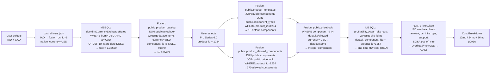

# CPQ Data Flow: Pro Series 6.0 — IAD (Washington DC) — CAD

> **Generated:** 2026-05-15 · Live data from Fusion PostgreSQL (via SSH tunnel) and MSSQL DM_BusinessInsights

---

## Scenario Parameters

| Parameter | Value |
|---|---|
| Data Center | IAD — Herndon (Washington DC) |
| `fusion_dc_id` | `8` |
| Native / Pricebook Currency | USD |
| Display Currency | CAD |
| USD → CAD Exchange Rate | **1.36659** |
| Rate Source | `DM_BusinessInsights.dbo.dimCurrencyExchangeRates` (latest `start_date DESC`) |
| Contract Terms Shown | 12 months · 24 months · 36 months |
| Product Line | Dedicated Hosting (`product_line_id = 4`) |

---

## Data Flow Diagram



---

## Step 0: DC & FX Setup

**Source:** `DM_BusinessInsights.dbo.dimCurrencyExchangeRates`

```sql
SELECT TOP 1 exchange_rate
FROM dbo.dimCurrencyExchangeRates
WHERE from_currency = 'USD' AND to_currency = 'CAD'
ORDER BY start_date DESC
```

**Result:**

| from_currency | to_currency | exchange_rate | Used for |
|---|---|---|---|
| USD | CAD | **1.36659** | Pricebook MRC, component MRC, overhead lines, HW CapEx conversion |

**DC config from `cost_drivers.json`:**

| Key | Value |
|---|---|
| `fusion_dc_id` | `8` |
| `native_currency` | `USD` |
| `overhead_constants.sga_pct` | `0.082` (8.2%) |
| `overhead_constants.support_hours_per_server` | `0.5 hrs/server/mo` |

---

## Step 1: Available Servers at IAD

**Source:** `fusion.public.product_catalog` JOIN `fusion.public.pricebook`

```sql
SELECT pc.id, pc.name, pc.sku,
       pb.mrc, pb.id AS pricebook_id
FROM public.product_catalog pc
JOIN public.pricebook pb ON pb.product_catalog_id = pc.id
WHERE pc.product_class = 1
  AND pc.is_active = true
  AND pb.currency = 'USD'          -- native DC currency
  AND pb.datacenter = 8            -- IAD fusion_dc_id
  AND pb.product_line_id = 4       -- Dedicated Hosting
  AND pb.component_id IS NULL      -- server-level rows only
  AND pb.mrc > 0
  AND pb.is_available = true
ORDER BY pb.mrc ASC
```

**19 results (ordered by MRC ascending):**

| product_id | Name | MRC (USD) | MRC (CAD) | Note |
|---|---|---|---|---|
| 974 | Essential Series 5.0 - D | $299.00 | $408.61 | |
| 1282 | Pro Dell PE R-660XS - Non NVMe | $345.00 | $471.47 | |
| 1270 | Fusion Series 5.0 | $399.00 | $545.27 | |
| 1288 | Cluster 5.0 | $399.00 | $545.27 | |
| 1289 | Atomix 5.0 | $449.00 | $613.60 | |
| 958 | Advanced Series 5.0 - D | $480.00 | $655.97 | |
| 950 | Storage Series 5.0 - D | $669.00 | $914.25 | |
| 949 | Pro Series 5.0 - D | $769.00 | $1,050.91 | |
| 1238 | Pro Dell PE 650xs - Non NVMe | $810.00 | $1,106.94 | |
| 1252 | Pro Dell PE R-660 - Non NVMe | $1,019.00 | $1,390.55 | |
| 1272 | Pro Dell PE R-660XS - NVMe | $1,019.00 | $1,390.55 | |
| 1299 | R470 - Advanced Series | $1,119.00 | $1,527.22 | |
| 1258 | Advanced Series 6.0 vHost | $1,139.00 | $1,554.62 | |
| 1255 | Advanced Series 6.0 | $1,139.00 | $1,554.62 | |
| 1240 | Pro Dell PE R-650 - NVMe | $1,205.00 | $1,644.74 | |
| 1263 | Storage Series 6.0 | $1,429.00 | $1,951.96 | |
| 1259 | Pro Series 6.0 vHost | $1,699.00 | $2,320.23 | |
| **1254** | **Pro Series 6.0** | **$1,699.00** | **$2,320.23** | **← selected** |
| 1300 | R670 - Pro Series | $1,719.00 | $2,347.58 | |

> CAD amounts = MRC (USD) × 1.36659

---

## Step 2: CPU Configuration — Pro Series 6.0 (`product_id = 1254`)

### 2a — Default CPUs

**Source:** `fusion.public.product_templates` JOIN `fusion.public.components` JOIN `fusion.public.component_types` JOIN `fusion.public.pricebook`

```sql
SELECT pt.component_id, pt.quantity,
       c.display_name AS name, ct.name AS component_type,
       pb.mrc AS component_mrc
FROM public.product_templates pt
JOIN public.components c ON c.id = pt.component_id
JOIN public.component_types ct ON ct.id = c.component_type_id
LEFT JOIN public.pricebook pb
    ON pb.component_id = pt.component_id
   AND pb.currency = 'USD' AND pb.datacenter = 8
   AND pb.product_line_id = 4 AND pb.is_available = true
WHERE pt.product_id = 1254
  AND ct.name ILIKE '%intel%'        -- CPU type filter
```

| component_id | Name | Type | Qty | MRC (USD) | MRC (CAD) | HW Cost (USD) |
|---|---|---|---|---|---|---|
| 6021 | Default Intel Xeon Gold 6526Y 2.8 GHz 16 Cores/32T (195W TDP) | Intel | 1 | $0.00 | $0.00 | $0.00 |
| 6021 | Default Intel Xeon Gold 6526Y 2.8 GHz 16 Cores/32T (195W TDP) | Intel | 1 | $0.00 | $0.00 | $0.00 |

> **Dual-socket configuration** — same CPU listed twice in `product_templates` (qty=1 each). The Dell R-660 supports 2 sockets.

### 2b — Available CPU Upgrades (swap or add)

**Source:** `fusion.public.product_allowed_components` JOIN `fusion.public.pricebook`

```sql
SELECT pac.component_id, c.display_name AS name,
       ct.name AS component_type, pb.mrc AS component_mrc
FROM public.product_allowed_components pac
JOIN public.components c ON c.id = pac.component_id
JOIN public.component_types ct ON ct.id = c.component_type_id
LEFT JOIN public.pricebook pb
    ON pb.component_id = pac.component_id
   AND pb.currency = 'USD' AND pb.datacenter = 8
   AND pb.product_line_id = 4 AND pb.is_available = true
WHERE pac.product_id = 1254
  AND ct.name ILIKE '%intel%'
```

| component_id | CPU Model | Cores / Threads | TDP | MRC (USD) | MRC (CAD) | vs Default |
|---|---|---|---|---|---|---|
| 6021 | Intel Xeon Gold 6526Y 2.8 GHz | 16C / 32T | 195W | $0.00 | $0.00 | ← default |
| — | Intel Xeon Gold 6326 2.9 GHz | 16C / 32T | 185W | $0.00 | $0.00 | same price, older gen |
| — | Intel Xeon Gold 6534 4.0 GHz | 8C / 16T | 195W | $460.00 | $628.63 | +$628.63/mo per CPU |
| — | Intel Xeon Gold 6548Y+ 2.5 GHz | 32C / 64T | 250W | $600.00 | $819.95 | +$819.95/mo per CPU |
| — | Intel Xeon Platinum 8558U 2.0 GHz | 48C / 96T | 300W | $600.00 | $819.95 | +$819.95/mo per CPU |

> **Upgrading both sockets** doubles the per-CPU MRC delta. e.g., swapping both to Gold 6548Y+ adds $1,639.90 CAD/mo.

**Where "how many CPUs can be added" comes from:**
The schema does not store a max-socket-count field. The constraint is physical: the Dell PowerEdge R-660 supports **2 sockets**. The system has 2 default CPUs, so **no additional CPU slots are available** — only upgrades/swaps per socket.

---

## Step 3: RAM Configuration

### 3a — Default RAM

| component_id | Name | Type | MRC (USD) | HW Cost (USD) |
|---|---|---|---|---|
| 6022 | 128 GB DDR5 RAM - Included | Included RAM | $0.00 | $536.00 |

### 3b — Available RAM Upgrades

RAM upgrades are priced as **total RAM after upgrade** (not incremental DIMMs). Selecting an upgrade replaces the default 128 GB included tier.

```sql
WHERE pac.product_id = 1254
  AND ct.name ILIKE '%ram%'    -- type = "Included RAM" / "128 GB Included"
```

| Total RAM After Upgrade | MRC (USD) | MRC (CAD) | Delta vs 128 GB included |
|---|---|---|---|
| 128 GB DDR5 (included) | $0.00 | $0.00 | baseline |
| 192 GB DDR5 | $115.00 | $157.16 | +$157.16/mo |
| 256 GB DDR5 | $120.00 | $163.99 | +$163.99/mo |
| 384 GB DDR5 | $185.00 | $252.82 | +$252.82/mo |
| 512 GB DDR5 | $255.00 | $348.48 | +$348.48/mo |
| 768 GB DDR5 | $380.00 | $519.31 | +$519.31/mo |
| 1,024 GB DDR5 | $505.00 | $690.13 | +$690.13/mo |
| 1,536 GB DDR5 | $760.00 | $1,038.61 | +$1,038.61/mo |
| 2,048 GB DDR5 | $1,010.00 | $1,380.26 | +$1,380.26/mo |

**Slot data:** The `public.components` table does not store DIMM slot count or fill status. The `description` field for RAM components mirrors the display name with no slot metadata. The Dell PowerEdge R-660 supports **32 DIMM slots** (hardware spec, not in DB). With 128 GB DDR5 installed, the number of filled slots depends on the DIMM configuration chosen at provisioning — this is not tracked in Fusion.

---

## Step 4: Storage Configuration

### 4a — Default Storage

Two 480 GB SSDs are included in the default configuration:

| component_id | Name | Type | Qty | MRC (USD) | MRC (CAD) | HW Cost (USD) |
|---|---|---|---|---|---|---|
| 3704 | 480 GB SSD (Intel S3520 or S4600) | SSD | 2 | $20.00 each | $27.33 each | $149.00 each |

**Default storage total:** 960 GB raw (RAID 1 = 480 GB usable)

### 4b — Available Storage Upgrades (SATA SSD)

Each drive below can be added individually. Source: `product_allowed_components` filtered by `component_type ILIKE '%ssd%'`.

| Drive | MRC (USD) | MRC (CAD) |
|---|---|---|
| 480 GB SSD | $20.00 | $27.33 |
| 960 GB SSD | $25.00 | $34.16 |
| 1.92 TB SSD | $50.00 | $68.33 |
| 3.84 TB SSD | $55.00 | $75.16 |
| 7.6 TB SSD | $60.00 | $81.99 |
| 8 TB SSD | $200.00 | $273.32 |

### 4c — Available NVMe Upgrades

Source: `component_type = 'NVMe'`

| Drive | MRC (USD) | MRC (CAD) |
|---|---|---|
| 960 GB SSD NVMe | $115.00 | $157.16 |
| 1.92 TB SSD NVMe | $475.00 | $648.63 |
| 3.2 TB SSD NVMe | $900.00 | $1,229.93 |
| 3.84 TB SSD PCIe NVMe | $500.00 | $683.30 |
| 6.4 TB SSD NVMe | $930.00 | $1,270.93 |
| 7.68 TB SSD NVMe | $1,660.00 | $2,268.54 |
| 15.36 TB SSD NVMe | $3,110.00 | $4,250.10 |

**What dictates how much can be added:**

| Constraint | Value | Source |
|---|---|---|
| Drive bays (Dell R-660 chassis) | Up to 10 × 2.5" bays | Hardware spec — **not stored in Fusion DB** |
| RAID configuration | RAID 1 (default) — halves usable capacity | `public.components` / `product_templates` |
| Max individual add | Any drive from the allowed list above | `public.product_allowed_components` |
| Capacity tracking | **Not stored in Fusion** — no `max_drives` or `slots_used` column | `public.components` columns: id, name, description, display_name, cost, discountable |

> The allowed-component list defines **what SKUs can be ordered**. Physical slot limits are a hardware constraint enforced operationally, not by the CPQ database.

---

## Step 5: Cost Breakdown — 12mo / 24mo / 36mo (all in CAD)

### Input values

| Input | USD | CAD (× 1.36659) |
|---|---|---|
| Server base MRC | $1,699.00 | $2,320.23 |
| Default components MRC total | $70.00 | $95.66 |
| **Total Customer MRC** | **$1,769.00** | **$2,415.89** |
| HW CapEx (server-level, `ocean_sku_cost` sku_id=1254) | $7,569.00 | $10,343.80 |

**Component MRC breakdown:** Redundant PSU $30 + SSD × 2 at $20 each = $70 USD/mo

### Overhead lines (IAD, USD → CAD via 1.36659)

**Source:** `cost_drivers.json` → `data_centers.IAD.costs`

| Cost Line | Measure | Amount (USD) | Amount (CAD) | Formula |
|---|---|---|---|---|
| Power | per_kW | N/A | N/A | kW not tracked in Fusion — no watt spec stored |
| DC R&M / Supplies | per_kW | $0.00 | $0.00 | Not configured |
| Network | per_server | $59.00 | $80.63 | $59 × 1.36659 |
| DC Infra / Ops | per_server | $19.00 | $25.96 | $19 × 1.36659 |
| Billing & Collections | per_server | $0.00 | $0.00 | Not configured |
| Supply Chain | per_server | $0.00 | $0.00 | Not configured |
| Support (Tech Time) | per_hour | $40.00 | $54.66 | $80/hr × 0.5 hrs × 1.36659 |
| DC People | per_server | $0.00 | $0.00 | Pending data |
| Network People | per_server | $0.00 | $0.00 | Pending data |
| Compute Team | per_server | $0.00 | $0.00 | Pending data |
| **SG&A (8.2%)** | pct_of_MRC | — | **$198.10** | $2,415.89 × 0.082 |
| **Total Overhead / mo** | | | **$359.35** | |

### Cost breakdown table

| Cost Item | 12 months | 24 months | 36 months |
|---|---|---|---|
| **HW CapEx (one-time, CAD)** | $10,343.80 | $10,343.80 | $10,343.80 |
| HW CapEx amortized / mo | $861.98 / mo | $430.99 / mo | $287.33 / mo |
| Customer MRC / mo | $2,415.89 / mo | $2,415.89 / mo | $2,415.89 / mo |
| Overhead / mo | $359.35 / mo | $359.35 / mo | $359.35 / mo |
| **Total Internal Cost / mo** | **$1,221.33 / mo** | **$790.34 / mo** | **$646.68 / mo** |
| Gross Margin / mo | $1,194.56 / mo | $1,625.55 / mo | $1,769.21 / mo |
| **Gross Margin %** | **49.5%** | **67.3%** | **73.2%** |

> HW CapEx/mo = $10,343.80 ÷ term months. MRC and overhead are identical across all terms — only CapEx amortization changes the margin.

### Formula reference

```
Total Customer MRC (CAD)  = (server_mrc + Σ component_mrc) × fx_rate
HW CapEx (CAD)            = ocean_sku_cost[product_id=1254].sku_cost × fx_usd
HW CapEx/mo               = HW CapEx ÷ term_months
Overhead/mo               = Σ cost_driver_lines × fx_rate + (total_mrc × 0.082)
Total Cost/mo             = HW CapEx/mo + Overhead/mo
Gross Margin %            = (Customer MRC − Total Cost) ÷ Customer MRC × 100
```

---

## Data Sources Reference

| Data Item | Database | Table | Key Columns | Notes |
|---|---|---|---|---|
| DC → fusion_dc_id, native_currency | Local file | `cost_drivers.json` | `data_centers[code].fusion_dc_id`, `native_currency` | Static config |
| USD → CAD rate | MSSQL DM_BusinessInsights | `dbo.dimCurrencyExchangeRates` | `from_currency`, `to_currency`, `exchange_rate`, `start_date` | Latest row (`ORDER BY start_date DESC`) |
| Server list | Fusion PostgreSQL | `public.product_catalog` + `public.pricebook` | `pc.id`, `pc.name`, `pb.mrc`, `pb.datacenter`, `pb.currency`, `pb.component_id` | `component_id IS NULL` = server-level row |
| Default components | Fusion PostgreSQL | `public.product_templates` | `product_id`, `component_id`, `quantity` | Joined to `components`, `component_types`, `component_categories`, `pricebook` |
| Allowed upgrades | Fusion PostgreSQL | `public.product_allowed_components` | `product_id`, `component_id` | Same joins as above |
| Component metadata | Fusion PostgreSQL | `public.components` | `id`, `display_name`, `description`, `component_type_id` | No slot/bay count stored |
| Component type / category | Fusion PostgreSQL | `public.component_types` + `public.component_categories` | `name`, `category_id`, `sort_order` | Used for grouping in UI |
| Component / server MRC | Fusion PostgreSQL | `public.pricebook` | `mrc`, `nrc`, `setup`, `currency`, `datacenter`, `product_line_id`, `component_id`, `is_available` | Always queried in native DC currency |
| HW CapEx (server-level) | MSSQL DM_BusinessInsights | `profitability.ocean_sku_cost` | `sku_id`, `sku_name`, `sku_cost`, `cost_currency` | `sku_id = product_catalog.id` is authoritative total CapEx |
| HW CapEx (component-level) | MSSQL DM_BusinessInsights | `profitability.ocean_sku_cost` | `sku_id`, `sku_cost` | `sku_id = component.id` — partial costs, used as fallback |
| Overhead line rates | Local file | `cost_drivers.json` | `data_centers[code].costs[key].amount`, `.measure`, `.currency` | Converted to display currency via FX |
| SG&A rate | Local file | `cost_drivers.json` | `overhead_constants.sga_pct` | 8.2% of total customer MRC |
| Support rate | Local file | `cost_drivers.json` | `overhead_constants.support_hours_per_server`, `costs.support_tech_rate.amount` | 0.5 hrs × $80/hr = $40/server/mo |
| Power cost | Local file + **Fusion (missing)** | `cost_drivers.json` + `public.product_catalog` (no kW field) | `costs.power_per_kw.amount` | **kW not stored** — N/A until watt data added to product specs |
| Physical slot counts (CPU, RAM, drive bays) | **Not in DB** | — | — | Dell R-660 spec: 2 CPU sockets, 32 DIMM slots, 10 × 2.5" bays — hardware constraint, not modelled in Fusion |
