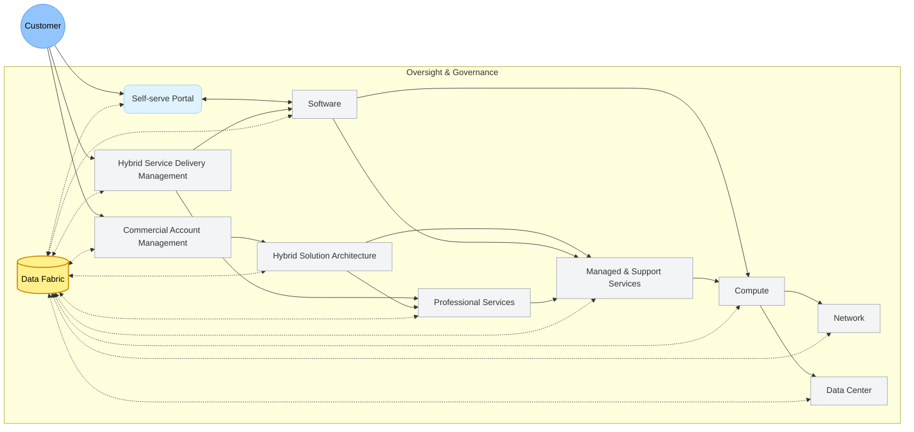

```mermaid
flowchart LR
    %% Nodes & Styling
    Customer((Customer))
    
    subgraph Oversight ["Oversight & Governance"]
        direction LR
        SSP("Self-serve Portal")
        SW["Software"]
        HSDM["Hybrid Service Delivery Management"]
        CAM["Commercial Account Management"]
        PS["Professional Services"]
        HSA["Hybrid Solution Architecture"]
        MSS["Managed & Support Services"]
        COMP["Compute"]
        NET["Network"]
        DC["Data Center"]
        
        %% New Data Node
        DATA[("Data Fabric")]
    end

    %% Customer Entry Points (Blue lines)
    Customer --> SSP
    Customer --> HSDM
    Customer --> CAM

    %% Service Interconnections (Solid grey lines)
    SSP <--> SW
    HSDM --> SW
    HSDM --> PS
    CAM --> HSA
    HSA --> PS
    HSA --> MSS
    SW --> MSS
    SW --> COMP
    PS --> MSS
    MSS --> COMP
    COMP --> NET
    COMP --> DC

    %% Data Connections (Dashed lines showing it ties everyone together)
    DATA <-.-> SSP
    DATA <-.-> SW
    DATA <-.-> HSDM
    DATA <-.-> CAM
    DATA <-.-> PS
    DATA <-.-> HSA
    DATA <-.-> MSS
    DATA <-.-> COMP
    DATA <-.-> NET
    DATA <-.-> DC

    %% Class styles
    classDef default fill:#f3f4f6,stroke:#9ca3af,stroke-width:1px;
    classDef customer fill:#93c5fd,stroke:#3b82f6,color:#000;
    classDef portal fill:#e0f2fe,stroke:#7dd3fc,rx:10,ry:10;
    classDef dataNode fill:#fef08a,stroke:#ca8a04,stroke-width:2px,color:#000;
    
    class Customer customer;
    class SSP portal;
    class DATA dataNode;
```