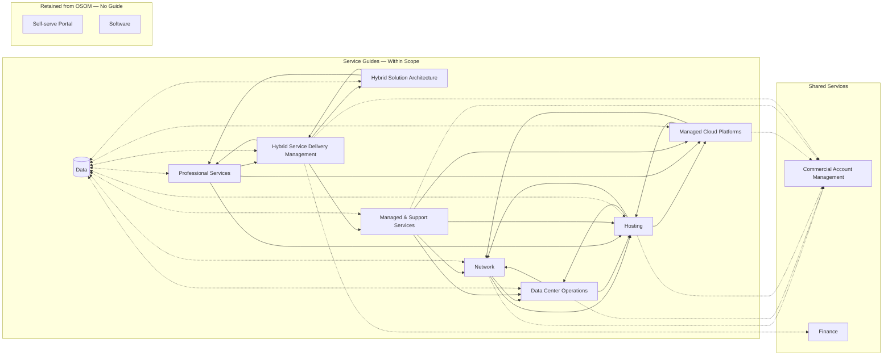

<!-- Compiled from vault/50-services/**/*.md for LLM context. Each top-level # is one service/network node. -->

# Compute Platforms

**Service Manager:** Martin Tessier
**Function:** Architecture & Delivery (one-time delivery, not ongoing operations)
**Lifecycle:** Live
**Note:** Previously referred to as Provisioning Engineering, Hosting, and Product Engineering. Canonical name is Compute Platforms.

> We build the compute. One time, to spec, automated where possible, documented, handed off clean. From bare metal to OS — then we step back.

---

## Accountable For

- Configuration standards across all compute products — what a correct environment looks like
- Automation playbooks for environment build: OS install, monitoring agent deployment, backup agent, config push
- Private cloud environment delivery: VMware ESXi, Proxmox
- AptCloud platform build and operations: Apache CloudStack, shared and dedicated clusters
- Handoff documentation and runbooks at environment completion
- L3 escalation support on all environments this team has built — they hold the deep technical knowledge

---

## Problems We Solve

- New customer environments need to be built correctly, consistently, and repeatably — manual provisioning does not scale
- Configuration drift from standards creates downstream operational problems for Service Desk and Managed Cloud
- Managed Cloud and Service Desk need clean, documented environments to do their jobs from day one
- AptCloud needs a platform engineering capability to build and mature shared-cluster infrastructure
- Physical-to-virtual and bare-metal-to-cloud migrations need a team that understands both layers

---

## Products and Services Supported

- Dedicated servers: Pro Dell PE R-660XS and full server catalog
- Private cloud: VMware ESXi 7.0/8.0, Proxmox
- AptCloud: Apache CloudStack, shared and dedicated clusters (Alpha — building toward Beta)
- Guest Virtual environments
- Storage platforms: NetApp FAS, SolidFire All-Flash

---

## Scope Boundary — Martin's Team vs. George's Team

This is the key operational question for this service. The answer is a functional split, not a consolidation.

**George's team owns everything physical:** racking, cabling, powering, physical inventory, remote hands. They deliver a server that is powered, racked, cabled, and network-connected.

**Martin's team owns everything that runs on top of that hardware:** configuration standards, automation playbooks, OS deployment, monitoring agent installation, backup agent installation, config push. They receive powered hardware from George and deliver a complete, documented, running environment.

### Why This Split — Not Consolidation Under George

Pushing all provisioning to George only works if George's team can also run playbooks, push configs, and install monitoring agents. That requires software and platform skills that are different from physical operations skills. George's team is built for facilities and physical ops. Martin's team is — or should become — a configuration and automation team.

### The Direction of Travel for Martin's Team

As the environment matures, the manual provisioning work shrinks. The target state is:

```
George's team racks and cables hardware → hardware registered in system
        ↓
Martin's automation runs against the registered device
(OS deploy, config push, monitoring agent, backup agent — automated)
        ↓
Validation runs → environment checked against standards
        ↓
Documentation generated → handoff triggered to Service Desk or Managed Cloud
```

This is also what makes AptCloud operationally viable at scale. Shared cluster nodes cannot be manually provisioned — automation is not optional for that product.

**Martin's team's value is in the playbooks and standards, not in the manual execution of them.**

---

## What This Team Does NOT Do

- Day 2 operational management of any environment after handoff — that is Service Desk or Managed Cloud
- Physical facilities, power, cabling, or remote hands — that is Data Center Ops
- Network configuration or logical network management — that is Network
- Customer relationship management or SOW ownership — that is HSDM
- OS-level support tickets on running environments — that is Service Desk

---

## AptCloud Specifics

- Platform: Apache CloudStack
- Infrastructure: Aptum-owned excess server inventory
- Cluster types: shared and dedicated
- Current status: Alpha — being prototyped on existing hardware
- Commercial intent: lower-cost public cloud alternative for customers who don't need hyperscaler scale
- Risk profile: shared clusters mean one misconfiguration affects all tenants on that cluster — qualitatively different from dedicated hosting
- Day 2 operations post-handoff: Service Desk (basic) and Managed Cloud (platform layer)
- This team retains L3 escalation on all AptCloud infrastructure

---

## Financial Model

### Revenue Touch
- Provisioning is a one-time cost of sale, not a recurring revenue line
- Enables all dedicated and managed hosting MRC by making environments exist
- AptCloud will generate recurring revenue when it exits Alpha — margin target to be defined at Beta pricing

### Direct Cost Driver
- Team labor: primary cost
- Provisioning time per environment is the key efficiency metric — automation reduces this directly
- AptCloud build is an investment cost against future recurring revenue

### Margin Profile
- Margin is indirect: quality and speed of provisioning protects hosting margin
- Rework after a bad provisioning job is a direct cost hit to the engagement
- Automation investment reduces per-environment cost over time — the leverage point for this team

### How We Are Measured
| Metric | Target |
|---|---|
| Provisioning accuracy (to spec, first time) | To be defined |
| Provisioning turnaround time | To be defined |
| Config validation pass rate (no remediation required) | To be defined |
| Documentation completeness at handoff | Met / not met |
| Runbook completeness at handoff | Met / not met |
| L3 escalation response time | To be defined |
| AptCloud cluster availability | To be defined (Alpha stage) |

---

## Key Dependencies

| Dependency | Direction | Notes |
|---|---|---|
| Data Center Ops | Inbound | Receives powered, racked, cabled, network-ready hardware |
| Network | Inbound | Network connectivity provisioned before build can begin |
| Service Desk | Outbound | Primary handoff destination for dedicated environments |
| Managed Cloud | Outbound | Handoff destination for private cloud and AptCloud environments |
| HSDM | Lateral | Provisioning timelines are SOW milestones — coordination required |

---

## Open Questions / Flags

- **Automation tooling ownership:** Who owns the playbook tooling (Ansible, Terraform, or equivalent) — Compute Platforms, Operational Intelligence, or a future platform engineering function — is an open question. The tooling is operational but also a shared infrastructure asset.
- **AptCloud Beta readiness:** Shared-cluster operations require change management discipline not required for dedicated work. Operational readiness review required before exiting Alpha.

---

# Data Center Ops

**Service Manager:** George Revie
**Function:** Operations
**Lifecycle:** Live

> We own the physical layer. The building, the power, the hardware in the rack. Everything Compute Platforms builds sits on what we provide.

---

## Accountable For

- Physical data center operations across all locations
- Rack and stack, cabling, decommissioning, remote hands
- Power, cooling, physical security
- Colocation environment management for customer-owned hardware
- Lease management and real estate runway across all sites
- Space and power capacity planning
- Physical asset inventory and CMDB accuracy
- Hardware remediation dispatched from Service Desk tickets (CMOS, PSU, disk, physical sensors)
- Delivering powered, racked, cabled, network-connected hardware to Compute Platforms for environment build

---

## Problems We Solve

- Customers need their hardware in a secure, available, well-maintained physical environment
- Hardware health events need to be physically resolved without customer involvement
- Colocation customers need right-sized space and power without over-provisioning
- Lease runway needs proactive management — a capacity crisis from an expiring lease is avoidable
- CMDB accuracy is a prerequisite for operational decisions, financial reporting, and audit compliance

---

## Products and Services Supported

- Colocation: ~768 services across all locations — customer-owned hardware in Aptum facilities
- Facility services: space, power, cooling, physical security
- Connectivity services: physical layer (cross-connects, fiber, patch panels)
- Remote hands: all locations
- Physical asset management: servers, switches, firewalls, storage arrays across the estate

### Data Center Locations
| Location | City | Approximate Services |
|---|---|---|
| South Pointe | Herndon, VA (USA) | 1,339 |
| Toronto / Pullman / 151 Front / King St | Toronto, ON (Canada) | 1,203 |
| Portsmouth / Croydon / Horner | Portsmouth / London (UK) | 1,091 |
| Atlanta | Atlanta, GA (USA) | 591 |
| Miami | Miami, FL (USA) | 570 |
| Malibu | Los Angeles, CA (USA) | 551 |
| Vancouver | Vancouver, BC (Canada) | 97 |
| Montreal / Barrie / Kirkland | Canada (various) | 49 |

---

## What This Team Does NOT Do

- Install operating systems or run configuration playbooks — that is Compute Platforms
- Network configuration or logical network management — that is Network
- Own monitoring alerts — DC Ops receives tickets from Service Desk; it does not own alert intake
- Customer relationship management — that is HSDM
- Financial reporting or cost center allocation — that is Finance with Operational Intelligence support

---

## Physical Remediation Flow

```
Hardware health alert fires (Zabbix)
        ↓
Service Desk receives and creates ticket
        ↓
Ticket dispatched to Data Center Ops
        ↓
DC Ops dispatches technician for physical fix
(CMOS battery, PSU swap, disk replacement, etc.)
        ↓
DC Ops updates ticket with resolution
        ↓
Service Desk closes ticket
Customer sees restored service — never touches the physical layer
```

---

## Financial Model

### Revenue Touch
- Colocation direct MRC: ~768 services (per-cabinet and per-cage pricing)
- Enables all physical hosting revenue by providing the facility layer that hardware sits in
- Lease and power costs are a direct COGS for colocation margin

### Direct Cost Driver
- Facilities: lease, power, cooling — largest non-labor cost in the org
- Labor: George's team distributed across multiple physical locations
- Geographic spread means cost is inherently distributed and cannot be fully centralized

### Margin Profile
- Colocation margin is primarily a function of utilization — rack space and power sold vs. capacity leased
- Target: rack utilization and power allocation as close to 100% as possible
- PUE (Power Usage Effectiveness) is a direct margin lever — lower PUE = better margin per kW sold

### How We Are Measured
| Metric | Target |
|---|---|
| Rack space utilization | As close to 100% as possible |
| Power allocation utilization | As close to 100% as possible |
| PUE | To be defined |
| MTTR for physical incidents | To be defined |
| Internal Incident Report (IIR) issuance | Within 24–48 hours of major incident |
| CMDB discrepancy vs. physical audit | 0% |
| Cycle count accuracy | As close to 100% as possible |
| Lease runway | Tracked quarterly |

---

## Key Dependencies

| Dependency | Direction | Notes |
|---|---|---|
| Compute Platforms | Outbound | Delivers hardware-ready environments for build |
| Network | Lateral | Physical cabling interfaces with Network's logical infrastructure |
| Service Desk | Inbound | Receives hardware remediation tickets dispatched from Service Desk |
| IT Operations & Engineering | Lateral | Facilities tooling, CMDB system |

---

## Open Questions / Flags

- **UK physical presence:** Portsmouth/Croydon/Horner accounts for ~1,091 services. Whether George's team has adequate local staffing in the UK for remote hands and hardware remediation — or relies on contracted third-party remote hands — needs to be explicit and documented.
- **LA/Malibu:** 551 services — comparable scale to Atlanta and Miami. Whether this location has equivalent local coverage is worth auditing.

---

# Hybrid Solution Architecture (HSA)

**Service Manager:** Pat Wolthausen
**Team:** Rob, Marcus, Andy (report to Pat)
**Function:** Architecture & Delivery
**Lifecycle:** Live
**Note:** Previous Service Manager Ian Crosby is deactivated.

> We own the scope and the budget inside every SOW. We are the architect — pre-sale and on the project. We do not just design it; we deliver it.

---

## Accountable For

- Technical scope definition and hour estimates for every SOW
- Budget ownership within each engagement (HSA owns the hours; HSDM adds PM overhead on top)
- Pre-sales solution design in partnership with Commercial
- Billable architectural delivery on PS engagements (target: ≥50% billable utilization)
- High-level design (HLD) documentation for all engagements
- Technical feasibility validation — nothing gets sold that cannot be delivered
- Architectural guidance to PS contributing teams during project execution

### Two Operating Modes
**Pre-sales mode:** Works with Commercial to design solutions, define scope, and write the technical sections of the SOW. Not billable in this mode — this is cost of sale recovered when the deal closes.

**Delivery mode:** Named billable resource on the engagement. Owns the architectural workstream through to completion. Accountable to HSDM for that portion of the SOW.

---

## Problems We Solve

- Solutions get sold that cannot be delivered
- Estimates are wrong and projects blow their budgets — HSA owns the hours, so HSA owns the accuracy
- No technical authority on the project — engineers implement inconsistently
- Commercial team cannot answer technical questions confidently in a sales cycle
- PS projects lack architectural consistency and documentation across engagements

---

## Products and Services Supported

- Pre-sales solution design across all product tiers (dedicated, private cloud, AptCloud, hyperscaler managed)
- Statements of Work — technical scope sections and hour estimates
- High-level designs for all PS engagements
- Billable architecture on: cloud migrations, private cloud implementations, VMware migrations, AptCloud onboarding, repatriation assessments

---

## What This Team Does NOT Do

- Own the SOW document or project delivery accountability — that is HSDM
- Execute hands-on technical deliverables — PS contributing teams do this
- Manage day-to-day platform operations — that is Managed Cloud or Service Desk
- Conduct commercial negotiations or pricing conversations — that is Fred's team
- Own customer relationships outside of active engagement delivery

---

## Financial Model

### Revenue Touch
- Billable hours embedded in PS SOWs — directly on the revenue line
- Target: ≥50% billable utilization across the team
- Pre-sales win rate directly affects top-line PS revenue and managed services pipeline

### Direct Cost Driver
- 4 people (Pat + 3 architects)
- Labor is the only cost
- Pre-sales time is non-billable overhead — recovered when the deal closes
- Under-utilization is the primary margin risk

### Margin Profile
- HSA hours billed at PS margin (~29.2%)
- Every hour below 50% billable utilization is a direct margin drag
- Architecture quality protects downstream margin — a wrong design is expensive to fix mid-project

### How We Are Measured
| Metric | Target |
|---|---|
| Billable utilization | ≥50% |
| SOW turnaround time | To be defined |
| Win rate on proposals | To be defined |
| Estimate accuracy (budget vs. actual) | To be defined |
| Customer satisfaction per engagement | To be defined |
| Estimate-to-actual variance | To be defined |

---

## Key Dependencies

| Dependency | Direction | Notes |
|---|---|---|
| Commercial (Fred's team) | Inbound | Brings opportunities requiring pre-sales design |
| HSDM | Lateral | Feeds scope and estimates; receives coordination on delivery engagements |
| Managed Cloud | Lateral | Validates cloud platform feasibility; early visibility on designs involving managed layer |
| PS contributing teams | Outbound | Provides architectural direction during project execution |
| External Customers | Inbound | Direct engagement during pre-sales and delivery modes |

---

# Managed Cloud

**Service Manager:** Andrei Ianouchkevitch
**Function:** Operations
**Lifecycle:** Live
**Note:** Source PDF is archived. Content reflects confirmed current state. Cost allocation correction in progress — see financial model.

> We manage everything from the OS upward. Public cloud, private cloud, AptCloud. The platform runs so customers do not have to think about it.

---

## Accountable For

- Managed operations from the OS layer upward across all cloud environment types
- Public cloud managed layer: Azure, AWS, GCP
- Private cloud operations: VMware ESXi, Proxmox (OS and above)
- AptCloud platform operations: Apache CloudStack (OS and above, post-handoff from Compute Platforms)
- Cloud-layer security and application delivery services (see delineation below)
- L3 escalation receipt from Service Desk for hyperscaler and platform issues
- Runbook ownership for all managed cloud environments
- BCP/DRaaS planning and testing for cloud customers

---

## Problems We Solve

- Customers lack internal expertise to manage cloud platforms at the OS and application layer
- Public cloud environments drift, degrade, and surprise customers without active management
- Private cloud environments need patching, backup, and monitoring that customers cannot self-manage
- Cloud incidents stall in Service Desk without a resolution path — Managed Cloud is that path
- AptCloud shared clusters need a managed operations layer before customers can consume them

---

## Products and Services Supported

- Managed Cloud Platform (MCP): Azure, AWS, GCP managed layer
- Private cloud managed operations: VMware ESXi 7.0/8.0, Proxmox
- AptCloud managed operations: Apache CloudStack shared and dedicated clusters (Alpha — building toward Beta)
- M365 managed services
- OS patching and management (Debian, Windows Server, Ubuntu, RHEL, Alma Linux)
- Managed backup: Veeam (cloud environments)
- Application performance monitoring: Datadog

### Cloud Networking — Boundary Clarification

This team owns the **security and application delivery layer** on top of network infrastructure. Ben's Network team owns the physical and logical network pipes. The practical delineation:

| Service | Owner | Why |
|---|---|---|
| WAF (Web Application Firewall) | Managed Cloud | Configured as a managed service policy, not a network device. Inspects HTTP/HTTPS traffic against customer application. |
| DDoS protection | Managed Cloud | Scrubbing service — cloud or managed appliance. Service configuration, not network infrastructure. |
| Hybrid cloud interconnects (ExpressRoute, Direct Connect) | Managed Cloud | The managed service wrapper and configuration. Physical circuit provisioned by Network; logical config and monitoring owned here. |
| MPLS, internet ports, routing, BGP | Network (Ben) | Physical and logical network infrastructure — OSI Layer 1-3. |
| Juniper SRX firewall (physical appliance) | Service Desk (L2 ops) + Network (connectivity escalation) + Managed Cloud (security policy escalation) | L2 ticket response: Service Desk. Physical connectivity issue: Network. Security policy / rule issue: Managed Cloud. |

**Practical test:** If it requires a Juniper CLI or a physical cable, it is Network. If it requires a portal, a policy, or a service configuration, it is Managed Cloud.

---

## What This Team Does NOT Do

- Own the physical or hypervisor build layer — that is Compute Platforms
- Perform L1/L2 ticket response for infra-layer incidents — that is Service Desk
- Provision new environments — that is Compute Platforms
- Own data center facilities or dispatch remote hands — that is Data Center Ops
- Manage network infrastructure, routing, or physical connectivity — that is Network

---

## Financial Model

### Revenue Touch
- MCP direct revenue: ~$625K YTD (F26 Actual)
- Enables ~$7.6M hyperscale revenue by providing the managed layer that justifies the margin
- AptCloud: pre-revenue (Alpha); target pricing and margin to be defined at Beta

### Direct Cost Driver
- ~8 people (Andrei's direct team)
- **Important:** 25 people were previously allocated to this cost center in financial reporting. Approximately 17 of those belong to Service Desk (Jason's org). This misallocation is being corrected.
- Corrected direct labor: ~$249K (8/25 of the reported $777K)
- Tooling: Datadog licenses, cloud management platform costs

### Margin Profile
| | As Reported | Corrected (8/25 labor) |
|---|---|---|
| Revenue | $625K | $625K |
| Direct Labor | $777K | ~$249K |
| Partner Services | $143K | $143K |
| Other Direct Costs | $16K | $16K |
| **Gross Margin** | **-$311K / -49.8%** | **~+$217K / ~+35%** |

Managed Cloud is one of the highest-margin products in the portfolio when correctly stated. The reported loss is a cost allocation artifact, not a product performance problem.

### How We Are Measured
| Metric | Target |
|---|---|
| Unplanned downtime per customer | Zero |
| Customer-created tickets | Zero |
| Total monitoring-generated tickets | Zero |
| Unplanned actions outside runbook | Zero |
| Baseline performance deviation | Zero |
| Price delta month-over-month | Zero |
| Runbook coverage | Met / not met per customer |
| BCP successfully exercised | Met / not met per test |
| Security standards compliance | Met / not met per review |

---

## Key Dependencies

| Dependency | Direction | Notes |
|---|---|---|
| Compute Platforms | Inbound | Receives provisioned environments at handoff |
| Service Desk | Inbound | Receives hyperscaler and platform triage escalations |
| Network (Ben) | Lateral | Physical network layer underneath cloud networking services |
| IT Operations & Engineering | Lateral | Corporate tooling and infrastructure support |
| Commercial (Fred's team) | Inbound | Customer onboarding and commercial context |

---

## Open Questions / Flags

- **AptCloud operational readiness:** Shared-cluster operations require more rigorous change management than dedicated hosting. One misconfiguration affects all tenants on that cluster. The team needs to be at operational readiness before AptCloud exits Alpha. Growth investment should happen before Beta, not after the first incident.
- **Team sizing:** 8 people carrying public cloud managed operations, private cloud operations, AptCloud build, and cloud networking services is thin. As AptCloud matures, build work will cannibalize BAU operational capacity without additional headcount.
- **Tooling ownership:** Datadog is currently used by this team. Who owns the Datadog contract, configuration standards, and integration with the broader monitoring stack is an open org question — see Tooling section in operational gaps.

---

# Network

**Service Manager:** Ben Kennedy
**Function:** Operations
**Lifecycle:** Live

> We connect everything. MPLS, internet, IP, cloud connect. If data moves between a customer and their environment, it moves on our network.

---

## Accountable For

- Network infrastructure design, implementation, and operations
- MPLS and internet connectivity across all data center locations
- IP address management, allocation, and monetization
- Cloud Connect and direct links to hyperscalers (physical circuit and port provisioning)
- Network access control and security boundaries across segments
- Network performance monitoring and incident response
- Compliance evidence for network-layer regulatory requirements
- Providing network-ready infrastructure to Data Center Ops and Compute Platforms

---

## Problems We Solve

- Customers need reliable, performant connectivity to their hosted environments
- Hybrid environments need seamless network connectivity across physical and cloud
- Security boundaries need to be enforced at the network layer
- IP address assets need to be managed accurately and monetized correctly
- Network incidents need to be resolved before they become customer-visible outages

---

## Products and Services Supported

- MPLS connectivity: Off-Net and On-Net ports (100Mbps, 1GigE, fiber)
- Internet access ports
- Fiber cross-connects and patch panel connections
- Cloud Connect / Direct Links (physical circuit — logical config handed to Managed Cloud)
- Bandwidth blocks
- IP address blocks
- Network switching: Juniper EX-4300T (48 ports, 81 units in estate)

---

## Scope Boundary — Network vs. Managed Cloud

This boundary is defined by the OSI model and by whether a service requires physical infrastructure or service configuration.

| Service | Owner | Reasoning |
|---|---|---|
| MPLS circuits, internet ports, routing, BGP peering | Network (Ben) | Physical and logical network infrastructure — OSI Layer 1–3 |
| Switching, patching, physical cable | Network (Ben) | Physical layer |
| Cloud Connect physical circuit and port | Network (Ben) | The physical pipe is Network's; provisioning the port |
| WAF (Web Application Firewall) | Managed Cloud (Andrei) | Service configuration and policy, not a network device |
| DDoS protection | Managed Cloud (Andrei) | Managed scrubbing service — cloud or managed appliance |
| ExpressRoute / Direct Connect logical config | Managed Cloud (Andrei) | Configuration, monitoring, and managed service wrapper |
| Juniper SRX firewall — physical connectivity | Network (Ben) escalation | When the physical port or circuit is the issue |
| Juniper SRX firewall — security policy | Managed Cloud (Andrei) escalation | When firewall rules or policy is the issue |
| Juniper SRX firewall — L2 ops and ticket response | Service Desk (Jason) | Day-to-day management and ticket response |

**Practical test:** If it requires a Juniper CLI or a physical cable, it is Network. If it requires a portal, a policy, or a service configuration, it is Managed Cloud.

---

## What This Team Does NOT Do

- Cloud networking security services (WAF, DDoS, hybrid interconnects) — that is Managed Cloud
- Physical cabling inside racks beyond standard patch work — that is Data Center Ops
- OS-level or application-layer configuration — that is Compute Platforms or Managed Cloud
- Customer relationship management — that is HSDM
- Firewall security policy management — that is Managed Cloud for escalations

---

## Financial Model

### Revenue Touch
- Connectivity services direct MRC: ~395 services
- Enables all hosted and colo revenue by providing the connectivity layer
- IP address assets: managed inventory with sale and lease monetization value
- Bandwidth blocks: ~51 services with direct MRC

### Direct Cost Driver
- Labor: Ben's team
- Transit costs: upstream network provider fees are a direct COGS
- Hardware depreciation: Juniper switching estate (EX-4300T, SRX series)

### Margin Profile
- Connectivity margin is a function of transit cost efficiency and utilization
- 99.999% uptime SLA — breach is a direct financial liability
- IP address assets are balance sheet items; accurate inventory management is a financial prerequisite

### How We Are Measured
| Metric | Target |
|---|---|
| Network uptime / availability | 99.999% |
| Network throughput | To be defined |
| Network latency | To be defined |
| Packet loss | To be defined |
| Average available capacity | To be defined |
| MTTR for network incidents | To be defined |
| Security incident frequency | To be defined |
| Compliance report | Met / not met per audit |
| IP addresses managed and accounted for | 100% inventory accuracy |

---

## Key Dependencies

| Dependency | Direction | Notes |
|---|---|---|
| Data Center Ops | Lateral | Physical layer interfaces at the data center — cabling, cross-connects |
| Compute Platforms | Outbound | Network must be provisioned before compute build can begin |
| Managed Cloud | Lateral | Cloud Connect logical config handed off after physical circuit is live |
| Service Desk | Inbound | Escalation path for network-layer incidents |
| IT Operations & Engineering | Lateral | Network management tooling |

---

# Operational Intelligence

**Service Manager:** Jorge Quintero
**Function:** Enablement
**Lifecycle:** Discovery

> We make the org's data usable. Every team generates operational signals. We turn those signals into decisions.

---

## Accountable For

- Data pipeline design and build across all services
- Unified customer view: ticket health, service footprint, consumption patterns
- Metrics infrastructure for all service managers
- Operational dashboards for management reporting
- Financial data accuracy support — cost center validation and correction
- Monitoring platform consolidation (the two-Zabbix problem — see below)

---

## Problems We Solve

- Service managers are making decisions without reliable data
- Two Zabbix systems create inconsistent alert routing and the risk of duplicate tickets
- No unified customer view means hybrid customer health is invisible to anyone
- Cost misallocations like the MCP/Service Desk issue go undetected without a cross-service data layer
- PS engagement profitability cannot be measured because costs are not tracked per engagement
- Management cannot see cross-service performance without manually compiling from multiple sources

---

## Products and Services Supported

This is a pure internal enablement function. No external customer-facing product.

- Data pipelines from: JSM, Zabbix (both instances), Ocean, financial systems
- Operational dashboards per service manager
- Unified customer health view (foundation for the CEM function when built)
- Financial accuracy reporting: cost center validation, per-team margin visibility
- Alert schema design and routing logic for consolidated monitoring

---

## What This Team Does NOT Do

- Own source data — each service team owns their operational data; OI makes it accessible and usable
- Replace Finance reporting — this is operational intelligence, not financial accounting
- Customer-facing reporting or portal development — that is a product decision
- IT infrastructure management — that is IT Operations & Engineering
- Make tooling decisions unilaterally — see ownership question below

---

## On the Two-Zabbix Problem

### Who Owns This

There are two distinct responsibilities:

**VP of Operations owns the decision:** Consolidation to a single monitoring platform requires a mandate that overrides each team's preference for their current tool. Ben, Andrei, and Jason each have reasons to prefer what they have. Without a VP-level mandate, this stays fragmented indefinitely. The decision is not Jorge's to make.

**Operational Intelligence owns the execution:** Once the decision is made, Jorge's team designs the unified alert schema, builds the routing rules, manages the migration plan, and validates that all alert coverage is preserved. This is technical work that sits naturally in OI as the data layer owner.

### Target State
```
Single monitoring platform (Zabbix consolidated or replacement)
        ↓
Normalized alert schema:
  Hardware health alerts → Service Desk queue
  Network alerts → Network queue
  Cloud platform alerts → Managed Cloud queue
  OS/application alerts → Service Desk queue → Managed Cloud if cloud
        ↓
Single routing ruleset into JSM
        ↓
One view per customer across all alert types
```

---

## Tooling Ownership — Broader Question

The org currently has no explicit owner for the operational tooling stack. This affects monitoring, automation, and service management tooling:

| Tool | Current Perceived Owner | Gap |
|---|---|---|
| JSM / Jira | IT | IT owns the platform; no one owns the operational configuration (routing rules, SLA clocks, automation) |
| Zabbix (internal) | Unclear | No named owner |
| Zabbix (customer-facing) | Unclear | No named owner |
| Datadog | Managed Cloud (Andrei) | Used by MC team; broader integration with OI data layer undefined |
| LogicMonitor | Unclear | Owner and integration path undefined |
| Ansible / automation playbooks | Compute Platforms (Martin) | Operational tooling but also a shared infrastructure asset |

### Recommended Ownership Model
- **IT owns the platform** (licensing, access management, corporate SSO integration, uptime of the tool itself)
- **Operational Intelligence owns the monitoring stack decisions** (which tools, how they integrate, what the data model looks like, consolidated alert schema)
- **Each operational team owns their configuration** within the agreed platform (what they monitor, their thresholds, their runbooks)

This model means Jorge's team is the decision-maker for the monitoring stack — not as an IT function but as the org's data layer owner. The monitoring stack *is* the source of operational data. Whoever owns the data layer should own the tools that generate it.

---

## Financial Model

### Revenue Touch
- Pure cost center — no direct revenue
- Value is indirect: better decisions, faster issue detection, accurate margin visibility
- Enabling correct cost allocation has already recovered a material margin misstatement (MCP correction: ~$466K swing in reported gross margin)

### Direct Cost Driver
- Jorge plus team (Discovery phase — team size TBD)
- Data infrastructure and tooling costs
- Investment phase: ROI realized through margin improvement, churn prevention, and operational efficiency

### Margin Impact (Indirect)
| Value Driver | Estimated Impact |
|---|---|
| 1% churn reduction on $13.5M revenue | ~$135K recovered |
| MCP cost allocation correction already completed | ~$466K margin swing |
| PS engagement profitability visibility | Enables higher-margin project selection |
| Unified monitoring → faster incident resolution | SLA breach prevention |

### How We Are Measured
| Metric | Target |
|---|---|
| Data pipeline availability | To be defined |
| Data freshness / latency | To be defined |
| Service coverage (active pipelines) | To be defined |
| Data accuracy vs. source systems | To be defined |
| Monitoring consolidation progress | Milestone-based |

---

## Key Dependencies

| Dependency | Direction | Notes |
|---|---|---|
| All operational services | Inbound data | Every service is a data source |
| Finance | Lateral | Cost center accuracy and financial data validation |
| IT Operations & Engineering | Lateral | Tooling platform access and integration |
| VP of Operations | Inbound mandate | Monitoring consolidation and tooling decisions require VP mandate to override team preferences |

---

## Open Questions / Flags

- **Acceleration out of Discovery:** Every month in Discovery is another month of decisions made without data. This is the highest-leverage investment in the org at this stage. What does OI need to move to Alpha?
- **Team size:** Discovery phase means team size is TBD. The scope (pipelines from 8 services, unified monitoring, customer health view, financial accuracy) is significant for an org of this scale.
- **CEM dependency:** The Customer Experience Management function, when built, is directly dependent on OI providing the customer health data layer. CEM cannot operate without OI being operational first.

---

# Professional Services

**Service Manager:** Open / To be defined
**Function:** Architecture & Delivery
**Lifecycle:** Live
**Note:** This is not a standalone organizational unit with dedicated headcount; it is a coordinated delivery model that draws resources from home teams.

> We execute the project. We draw the right expertise from across the org, manage the engagement, and hand over a finished, documented environment so the operational teams can take over cleanly.

---

## Accountable For

- Cross-functional delivery of non-recurring, project-based customer engagements
- Executing project deliverables according to the signed Statement of Work (SOW) within the agreed timeline and budget
- Resource coordination and dotted-line management of engineers seconded from home teams
- Maintaining engagement quality and consistency across disparate technical resources
- Structured, documented handoffs to Managed Cloud and Service Desk at project completion

---

## Problems We Solve

- Complex technical projects require cross-functional skills that do not exist on a single team
- Projects risk unexpected overruns or scope gaps without centralized delivery accountability
- Home team managers risk having their operational capacity drained by unstructured project work
- Operational teams (Managed Cloud, Service Desk) risk inheriting undocumented, unsupportable environments if project handoffs are poor

---

## Products and Services Supported

- Project execution across all products: cloud migrations, hardware refreshes, VMware migrations, private cloud implementations, security audits, and FinOps assessments
- Coordinated resource utilization (dotted-line management)

---

## What This Team Does NOT Do

- Maintain a dedicated permanent technical headcount — resources are drawn from home teams
- Define the technical scope or estimate the hours for the SOW — that is Hybrid Solution Architecture (HSA)
- Manage ongoing day 2 operations — that is Managed Cloud or Service Desk

---

## Operating Model

Professional Services operates via a matrixed resource model:

- **Request & Approval:** Hybrid Service Delivery Management (HSDM) identifies required skills and requests resources. The Home Team Service Manager must formally approve the draw to protect their operational commitments.
- **Execution:** Seconded team members operate under a clearly defined scope for the duration of the engagement.
- **Accountability:** The Home Team SM retains quality accountability for their seconded engineer's work, while HSDM owns overall project delivery and timeline.
- **Handoff:** At project close, complete provisioning documentation and runbooks are handed off to operational teams.

---

## Financial Model

### Revenue Touch
- Direct project-based revenue: $738K YTD (F26 Actual)

### Direct Cost Driver
- Actual YTD Direct Labor: $485K
- Actual YTD Partner Services: $16K
- Actual YTD Other Direct Costs: $21K
- Total Direct Costs: $522K

### Margin Profile
- Gross Margin (with Direct Labor): $216K
- Gross Margin %: 29.2%
- Margin Note: At 29.2%, PS is one of the higher-margin segments, but profitability is highly dependent on controlling scope creep and preventing SOW variance.

### How We Are Measured
| Metric | Target |
|---|---|
| SOW delivery accuracy | To be defined (% deviation from SOW time/budget) |
| Project delivery on-time | To be defined (Milestone tracking vs. committed dates) |
| Customer satisfaction score | To be defined (Post-project survey) |
| Resource approval turnaround | To be defined (Time from request to SM approval) |
| Engagement profitability | To be defined (Blended margin across contributing teams) |
| Change orders vs. original SOW | To be defined (Count and value) |

---

## Key Dependencies

| Dependency | Direction | Notes |
|---|---|---|
| Hybrid Service Delivery Mgt (HSDM) | Internal | Owns the overarching engagement and resource coordination |
| Hybrid Solution Architecture (HSA) | Internal | Defines the SOW scope and budgets the hours |
| Compute Platforms | Internal | Home team resource contributor |
| Data Center Ops | Internal | Home team resource contributor |
| Network | Internal | Home team resource contributor |
| Service Desk | Internal / Outbound | Home team resource contributor; receives day 2 operational handoff |
| Managed Cloud | Internal / Outbound | Home team resource contributor; receives managed operations handoff |

---

## Identified Issues & Open Questions

- **Ownership Gap (Service Manager):** The owner of Professional Services is currently listed as "Open." Because this model heavily relies on cross-functional coordination, lacking a defined owner creates a massive accountability vacuum for project execution.
- **Overlap with HSDM:** The accountabilities listed for this service (owning SOW execution, drawing resources from home teams, dotted-line management) heavily overlap with the workflows currently owned by Lacie Allen-Morley under Hybrid Service Delivery Management (HSDM). It needs to be clarified whether PS is a standalone operational function needing a new leader, or just a financial/product category managed by HSDM.
- **The Direct Labor Contradiction:** The operating model states PS is "not a standalone org unit with dedicated headcount." However, the financial sheet shows $485K of Actual Direct Labor sitting directly in the Professional Services column. If there is no dedicated headcount, whose salaries are making up this $485K?
- **Partner Services Budget Overrun:** The financial sheet shows an actual YTD Partner Services spend of $16K against a budget of only $2K. Are third-party contractors being utilized to fulfill project gaps because home team Service Managers are rejecting internal resource requests?

---

# Hybrid Service Delivery Management (HSDM)

**Service Manager:** Lacie Allen-Morley
**Function:** Architecture & Delivery
**Lifecycle:** Live

> We own the customer. Every SOW, every engagement, every account interaction that doesn't require a sales call — the single throat to choke.

---

## Accountable For

- Customer relationship end-to-end across all services
- Statement of Work ownership, profitability, and on-time delivery
- Coordinating Professional Services resource draws from home teams (dotted-line engagement model)
- Escalation management and stakeholder alignment during engagements
- Customer health visibility and relationship continuity between projects
- Post-project handoff to operational teams with full documentation

### Account Operations (Non-Sales Commercial Transactions)
The board's mandate is that Fred's account managers and Marc Alex's new logo reps are myopically focused on customer conversations — no administrative leakage. SDMs own everything that touches an account but does not require a sales call:

- Contract renewals (existing pricing — no new commercial negotiation)
- Order entry
- Credit requests
- Cancellations
- Any account administration that would otherwise pull a Commercial rep off a customer conversation

---

## Problems We Solve

- Customer doesn't know who to call — one number, one owner
- Projects slip because nobody owns the schedule
- SOW scope creep goes unmanaged
- Post-project customer feels orphaned until renewal
- Multiple teams giving customer conflicting information
- Account admin tasks leaking Commercial team time away from selling

---

## Products and Services Supported

- All Professional Services engagements: cloud migrations, hardware refreshes, VMware migrations, private cloud implementations, security audits, FinOps assessments, repatriation assessments
- Ongoing relationship management for all managed service customers between projects
- Internal PS coordination model — resource draws from contributing home teams with SM approval gate

---

## What This Team Does NOT Do

- Define technical scope or write hour estimates — that is HSA (SDMs own the SOW document; HSA owns the scope bullets and the hours)
- Execute technical deliverables — PS contributing teams do this under dotted-line coordination
- New commercial negotiations, new pricing, new logo acquisition — that is Fred's team and Marc Alex's team
- Day 2 operational ticket management — that is Service Desk
- Proactive customer health monitoring between projects — this is a gap; see CEM in operational gaps

---

## Professional Services Operating Model

HSDM coordinates but does not own dedicated delivery headcount. Every PS engagement works as follows:

1. HSA defines technical scope and estimates; HSDM adds PM overhead to produce the SOW
2. HSDM identifies required skills and requests resources from relevant home team SMs
3. Each home team SM formally approves before their team member is seconded
4. Seconded resources work under HSDM coordination for the duration of the engagement
5. Home team SM retains quality accountability for their seconded team member
6. HSDM owns overall engagement quality and delivery accountability end to end
7. At project close, HSDM manages handoff to Managed Cloud or Service Desk with documentation

---

## Financial Model

### Revenue Touch
- Owns PS revenue: ~$738K YTD (F26)
- Relationship owner for all ~$13.5M in customer revenue
- Retention improvement and churn reduction sit here — 1% improvement = ~$135K

### Direct Cost Driver
- Small team — Lacie plus SDMs and coordinators
- Labor is the primary cost
- PS resource costs flow through contributing team cost centers, not HSDM
- Account operations (order entry, renewals) carry administrative labor cost — monitor for SDM time displacement

### Margin Profile
- PS gross margin: 29.2% — second-highest in the portfolio
- Margin at risk if PS projects slip due to resource contention with BAU operations
- Retention margin: every customer retained at existing MRC is 100% of that MRC protected

### How We Are Measured
| Metric | Target |
|---|---|
| Project delivery on-time | ≥95% |
| Customer satisfaction score | ≥4.5/5.0 |
| Revenue variance vs. SOW | ≤5% |
| Escalation rate | ≤2% of total interactions |
| Customer retention post-project | ≥95% |
| Project status reporting timeliness | 100% on schedule |
| SOW turnaround time | To be defined |
| Estimate accuracy | To be defined |

---

## Key Dependencies

| Dependency | Direction | Notes |
|---|---|---|
| Hybrid Solution Architecture | Inbound | Receives scope and budget for every SOW |
| Service Desk | Outbound | Buys day 2 operational coverage for managed customers |
| Managed Cloud | Outbound | Buys platform operations for cloud customers |
| Compute Platforms | Outbound | Buys provisioning capacity at agreed project milestones |
| Data Center Ops | Outbound | Buys physical facility and remote hands capacity |
| Network | Outbound | Buys connectivity capacity |
| Commercial (Fred's team) | Lateral | Receives customer handoffs at project close; hands back commercial signals |
| Operational Intelligence | Inbound | Customer health data and unified view (enabling CEM function when built) |
| Finance | Lateral | Project cost tracking and profitability reporting |

---

## Open Questions / Flags

- **CEM gap:** No one currently owns proactive customer health monitoring between projects. This is a retention risk. A thin CEM function (1-2 people) sitting within HSDM with a distinct operational trigger model is the recommended resolution.
- **SDM administrative load:** Order entry, renewals, and credit requests are the right home but carry administrative burden. Monitor whether a dedicated ops coordinator is needed to prevent SDM time displacement from customer-facing work.

---

# Service Desk / NOC

**Service Manager:** Jason Auer
**Team Size:** ~17 people
**Function:** Operations
**Lifecycle:** Live

> We are the first call for every managed customer. We own day 2 operations. We triage, we route, we resolve — and the ticket stays with us until it is closed.

---

## Accountable For

- Day 2 operations for all dedicated and managed hosting customers
- First response on all inbound tickets — customer-submitted and monitoring-generated
- Infrastructure-layer incident ownership (L2/L3)
- Hardware health alert receipt and routing to Data Center Ops for physical remediation
- Hyperscaler and cloud platform triage, escalation to Managed Cloud
- SLA/SLO compliance across all managed customers by priority level
- Customer portal and real-time ticket status visibility
- Shift coverage across NA and UK time zones (3 shifts, including 2-person graveyard)
- L3 resource contribution to PS engagements (with SM approval)

---

## Problems We Solve

- Customers need someone available 24/7 when things break
- Hardware faults need to be caught and resolved before the customer notices — the car needs an oil change, not the driver
- Cloud incidents need to reach the right technical team without customer involvement
- Customers with hybrid environments (dedicated + cloud) need one number, one owner
- SLA breach risk needs proactive management, not reactive response

---

## Products and Services Supported

- Managed Hosting: ~2,949 services — primary operational home
- Dedicated Hosting: ~1,620 services — day 2 operations
- Physical server estate: ~2,526 servers across Dell PE R-660XS, Pro Series 5.0, Advanced Series 5.0, and full catalog
- Firewall management: 417 Juniper SRX devices (L2 ops; policy escalation to Managed Cloud)
- Managed backup: Veeam
- OS support: Debian 12.x, Windows Server (2016/2019/2022), Ubuntu, CentOS, RHEL, Alma Linux, Rocky Linux
- Hardware health monitoring: power supply, CMOS, disk health, temperature, physical sensors
- VMware ESXi environments: ~126 hypervisor hosts (L2 ops; escalation to Compute Platforms for L3)

---

## What This Team Does NOT Do

- Cloud platform operations above the OS layer — that is Managed Cloud
- Physical hardware remediation — that is Data Center Ops (tickets routed there; DC Ops dispatches the fix)
- Network infrastructure configuration — that is Network
- Provisioning new environments — that is Compute Platforms
- Own the customer relationship — that is HSDM
- Make tickets unassigned when status changes — tickets stay assigned to the owning engineer at all times

---

## Operating Model — Ticket Ownership

**Tickets are never unassigned.** Ownership does not transfer to the pool when status changes to Waiting on Customer, when a shift ends, or when an engineer goes on leave. "If someone leaves for the night the ticket will go unattended" is a coverage gap problem, not a ticket ownership problem. Coverage gaps are solved with scheduling and shift handoff — not by removing ownership.

### Assignment Model
Every customer is assigned to a named primary engineer. New tickets from that customer route to their primary engineer if on shift, or to a named pod colleague if off shift.

Customers are organized into three pods (~140 customers each):
- Each pod has engineers distributed across shifts
- Two graveyard engineers cover all pods overnight — they are caretakers, not owners

### Graveyard Shift Protocol
The two graveyard engineers have a specific and bounded job:
- **Monitor** — watch for P1/P2 tickets across all customers
- **Stabilize** — stop the bleeding; do not resolve unless straightforward
- **Document** — structured note on every ticket touched before shift end
- **Escalate** — wake the on-call primary engineer for genuine criticals

### Shift Handoff
At shift end, graveyard engineers update every touched ticket with a structured handoff note: what happened, what was done, what is pending. JSM automation flags all graveyard-touched tickets at the top of the primary owner's queue at shift start.

### JSM Configuration
- Customer organization mapped to pod in JSM
- Assignee automation based on shift schedule (Opsgenie integration)
- SLA clock runs regardless of status or assignee — does not pause for shift changes
- Waiting on Customer status: ticket stays assigned; JSM automation sends follow-up reminder to assignee after defined interval

---

## Hardware Health Alert Flow

Customers renting dedicated environments are not responsible for underlying hardware health. That is Aptum's obligation.

```
Zabbix alert fires (CMOS, PSU, disk, temperature, physical sensor)
        ↓
Service Desk receives → creates ticket → remains assigned to Service Desk engineer
        ↓
Ticket dispatched to Data Center Ops for physical remediation
        ↓
DC Ops fixes hardware → updates ticket
        ↓
Service Desk closes ticket → customer sees restored service
Customer never interacts with the physical layer
```

---

## Financial Model

### Revenue Touch
- Enables Legacy Managed: ~$514K YTD (100% gross margin)
- Enables Foundation: ~$128K YTD (100% gross margin)
- Enables all Managed and Dedicated Hosting MRC across ~4,569 services
- ~17 of 25 people previously misallocated to Managed Cloud cost center belong here — correction in progress

### Direct Cost Driver
- ~17 people — largest team in the org, appropriate for ~4,569 services supported
- Labor distributed across 3 shifts including 2-person graveyard
- Previously misallocated to the Managed Cloud cost center — being corrected

### Margin Profile
- Legacy Managed and Foundation run at 100% gross margin; Service Desk labor is the primary COGS
- Graveyard coverage model (2 people vs. full shift) is the key overnight cost efficiency lever
- SLA breach carries financial liability — margin erosion risk on SLA-governed contracts

### How We Are Measured
| Metric | Target |
|---|---|
| Ticket acknowledgement within SLA/SLO | By priority tier — to be defined |
| MTTA | To be defined |
| MTTR | To be defined |
| Unplanned downtime across managed estate | To be defined |
| Escalation routing accuracy | To be defined |
| Customer satisfaction score | To be defined |
| Total capacity (hours) | Monthly |
| Contractual commitment (hours) | Monthly |
| Overages (billable and non-billable) | Monthly |

---

## Key Dependencies

| Dependency | Direction | Notes |
|---|---|---|
| Managed Cloud | Outbound escalation | Hyperscaler and cloud platform triage |
| Compute Platforms | Outbound escalation | L3 for deep technical issues on built environments |
| Data Center Ops | Outbound dispatch | Physical hardware remediation |
| Network | Outbound escalation | Network-layer incidents |
| HSDM | Lateral | HSDM owns the customer; Service Desk owns the ticket |
| Operational Intelligence | Inbound | Unified monitoring, ticket health, customer view |

---

## Open Questions / Flags

- **UK coverage:** ~1,091 services in Portsmouth/UK. Whether UK customers receive adequate response during UK business hours from a North American NOC needs explicit confirmation. A UK team lead or UK-based headcount is likely required.
- **Two Zabbix systems:** One internal-facing, one customer-facing. Consolidation decision sits with VP of Operations; execution with Operational Intelligence.
- **Tooling ownership:** Who owns the Zabbix configuration, thresholds, and routing schema is an open organizational question pending the broader tooling ownership decision.

---

# Service Network — Baseline (Declared Dependencies Only, Not Validated)

%% Derived from declared upstream dependencies in service guides. Not validated. Last updated: 2026-02-24.


