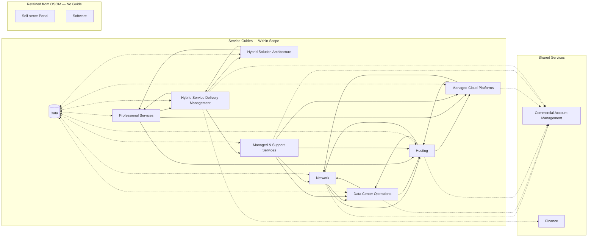

# Service Network — Baseline (Declared Dependencies Only, Not Validated)

%% Derived from declared upstream dependencies in service guides. Not validated. Last updated: 2026-02-24.

```mermaid
flowchart LR
    %% Nodes: nine services from guides
    subgraph Nine ["Service Guides — Within Scope"]
        direction LR
        NET["Network"]
        DC["Data Center Operations"]
        Host["Hosting"]
        MCP["Managed Cloud Platforms"]
        PS["Professional Services"]
        HSA["Hybrid Solution Architecture"]
        MC["Managed & Support Services"]
        HSDM["Hybrid Service Delivery Management"]
        DATA[("Data")]
    end

    %% SSP and SW retained from OSOM model. No service guides exist for these nodes in this initiative.
    subgraph Legacy ["Retained from OSOM — No Guide"]
        SSP["Self-serve Portal"]
        SW["Software"]
    end

    subgraph Shared ["Shared Services"]
        direction TB
        CAM["Commercial Account Management"]
        Finance["Finance"]
    end

    %% Declared upstream dependencies (within-nine): A --> B means A depends on B
    NET --> DC
    NET --> Host
    DC --> Host
    DC --> NET
    Host --> MCP
    Host --> DC
    Host --> NET
    MCP --> Host
    MCP --> NET
    PS --> HSDM
    PS --> MCP
    PS --> Host
    HSA --> PS
    HSA --> HSDM
    MC --> MCP
    MC --> DC
    MC --> NET
    MC --> Host
    HSDM --> PS
    HSDM --> MC
    HSDM --> HSA

    %% Dependencies to Shared Services (dashed)
    NET -.-> CAM
    DC -.-> CAM
    Host -.-> CAM
    MCP -.-> CAM
    MC -.-> CAM
    HSDM -.-> CAM
    HSDM -.-> Finance

    %% Data: bidirectional dashed to all within-nine nodes
    DATA <-.-> NET
    DATA <-.-> DC
    DATA <-.-> Host
    DATA <-.-> MCP
    DATA <-.-> PS
    DATA <-.-> HSA
    DATA <-.-> MC
    DATA <-.-> HSDM
```
